# Implement API endpoint and complete canary deployment on Microservices using Oracle Developer Cloud Service

## Lab Overview
In this lab you’ll learn how to leverage Oracle Developer Cloud Service to build container packaged application (API endpoint), push to Oracle Cloud Infrastructure Registry finally deploy to Microservices platform using build jobs. The key steps are the following:

1. Create container repository using Oracle Cloud Infrastructure Registry to store container packaged services (V1, V2)
2. Create build job to package service V1 in container and push to container registry
3. Deploy service V1 to Microservices platform and test
4. Create build job to package service V2 in container and push to container registry
5. Deploy service V2 to Microservices platform
6. Check that service is still being served fully by V1
7. Change the Istio rule to define canary deployment and define traffic percentages as 50/50 and check that half of the requests are being served by V1 and half by V2
8. Change the Istio rule to define canary deployment and define traffic percentages as 0/100 and check that all requests are being served by V2

## Prerequisites

- [DevCS project contains application source code repository](DevCS.md)
- Microservices platform running on Oracle Kubernetes Engine
- Access to OCI-OKE console

### 1. Create container repository using Oracle Cloud Infrastructure Registry to store container packaged services

Open your OCI console and from the left navbar choose Developer Services than select Registry(OCIR).

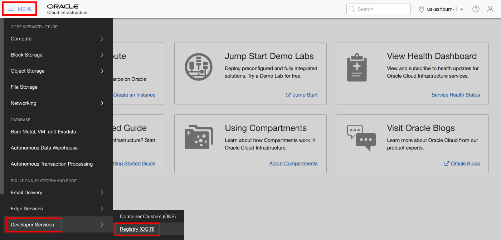

Click Create Repository.

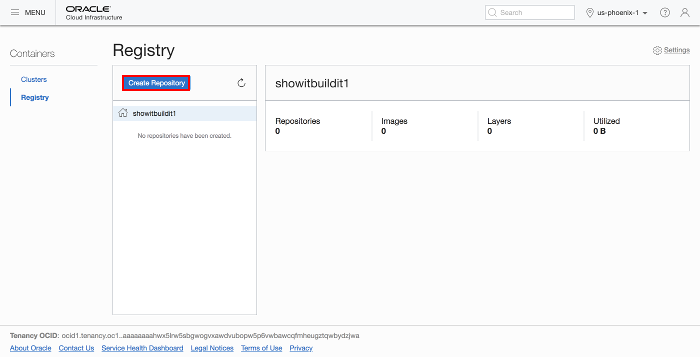

Fill out the following:
-	Repository Name: eca-<compartment-name\>

IMPORTANT: REPOSITORY NAME MUST FOLLOW THAT NAMING CONVENTION!!!

  For example **eca-c001**
-	Access: Private

Click Submit.

Verify the repository.

### 2. Create build job to package service V1 in container and push to container registry

Open your DevCS project and from the left navbar choose Build. Click +New Job to create a build job.

Fill out the following:
-	Job Name: build_service_V1
-	Description: build and store service V1
-	Create New: yes
-	Software Template: eca-template

Click Create Job.

The build job configuration opens. On the first Source Control tab click Add Source Control and select Git. From the Repository dropdown list select the source code repository for service V1. Check the box to "Automatically perform build on SCM change", this will automate the flow so every time code is changed in your Git repostiory a build will start.

Change to Builders tab and define the build steps. Add your first step by clicking on Add Builder button. Select Docker Builder than Docker login.

Fill out the following:
-	Registry Host: phx.ocir.io
-	Username: showitbuildit1/aura
-	Password: Auth token (distributed by the instructor on cheat sheet - it is NOT Docker password - look for Auth token)

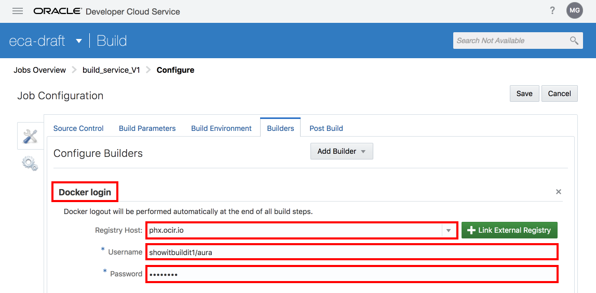

Click again the Add Builder and select Docker build.

Fill out the following:
-	Registry Host: phx.ocir.io
-	Image name: showitbuildit1/<repository-name\> (what you created above using the format eca-<compartment-name\>)
-	Version Tag: 1.0
- Context Root in Workspace: yes
- Dockerfile: Dockerfile_V1

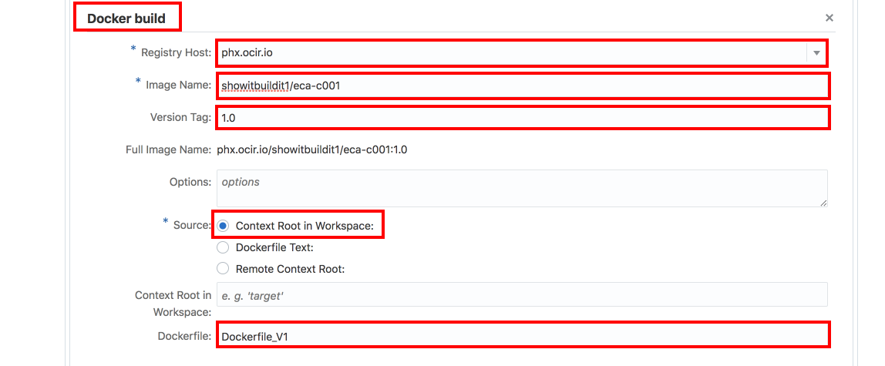

Click again the Add Builder and select Docker push.

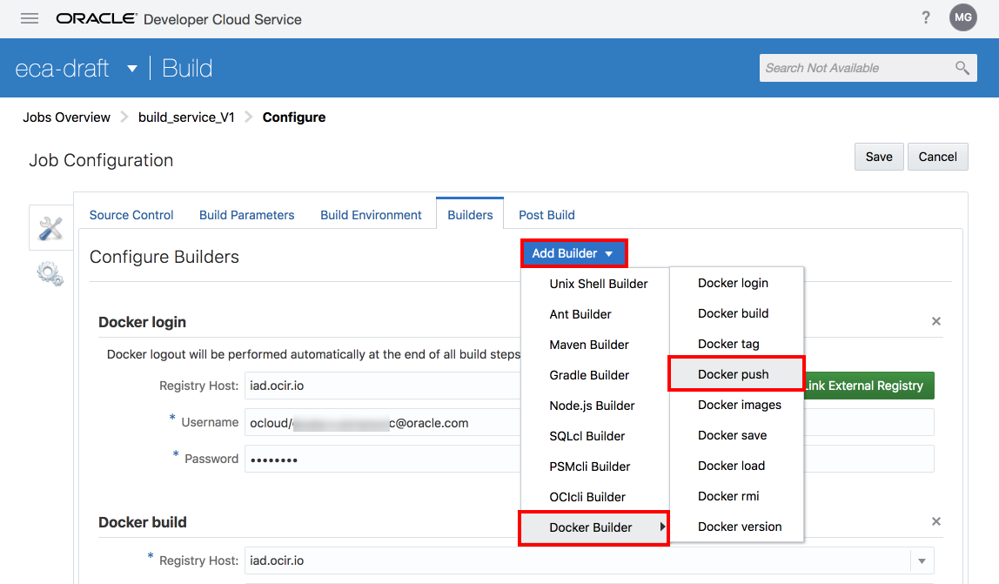

Fill out the following:
-	Registry Host: phx.ocir.io
-	Image name: showitbuildit1/<repository-name\> (what you created above using the format eca-<compartment-name\>)
-	Version Tag: 1.0

Click Save.

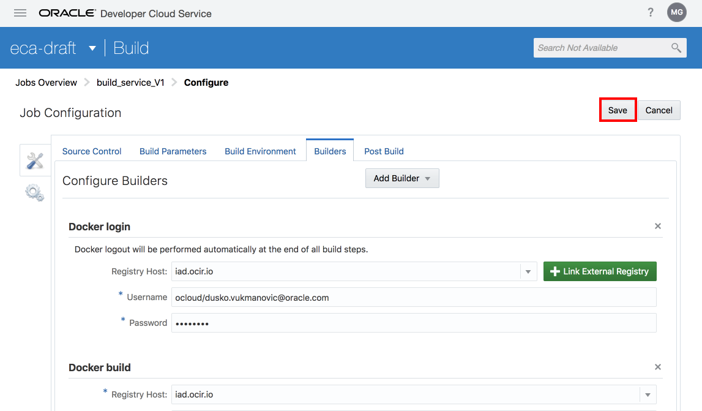

Click on Build now.

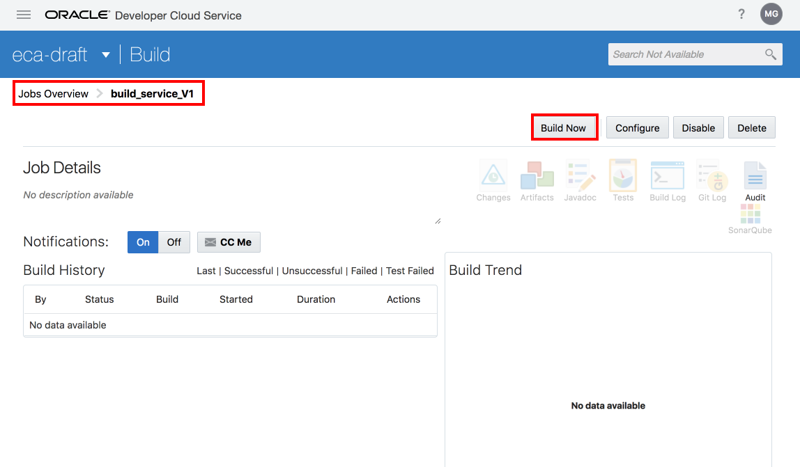

You don't need to wait for the result if there is no available Executor. You can continue with the following step and get back to verify in Registry when the job is completed.

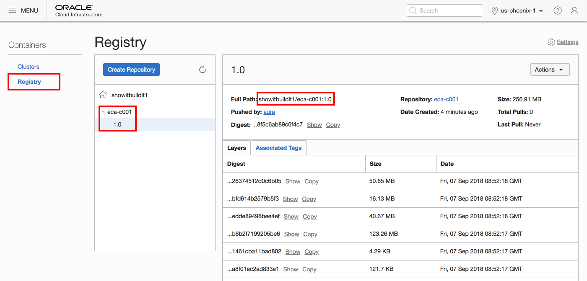

### 3. Deploy service V1 to Microservices platform and test

To deploy service V1 to Microservices you will use Build Job again to avoid `kubectl` installation and configuration to your desktop.

But before move to the Build Job creation you need to collect your OCI and OKE instance details to configure `kubectl` which will be executed in the build environment. You need to have the following information:

- User OCID
- Private pair of your API key (provided by instructor)
- Fingerprint of API key (provided by instructor)
- Tenancy OCID
- Cluster OCID

To get these information login to your [OCI tenant](https://console.us-phoenix-1.oraclecloud.com/) as non-federated user (right side) using your credentials. The tenant name also shared by the instructor.

Click on the user icon on the top right corner and select User Settings.

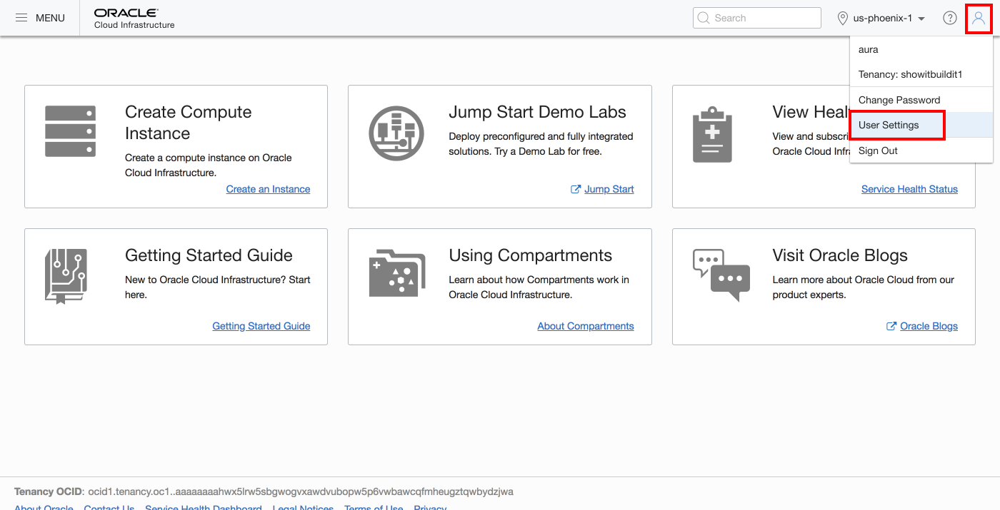

Click link Copy next to OCID label in the User Information area to copy User OCID to clipboard. Note the User OCID. At the bottom of the page select and copy Tenancy OCID to your notes.

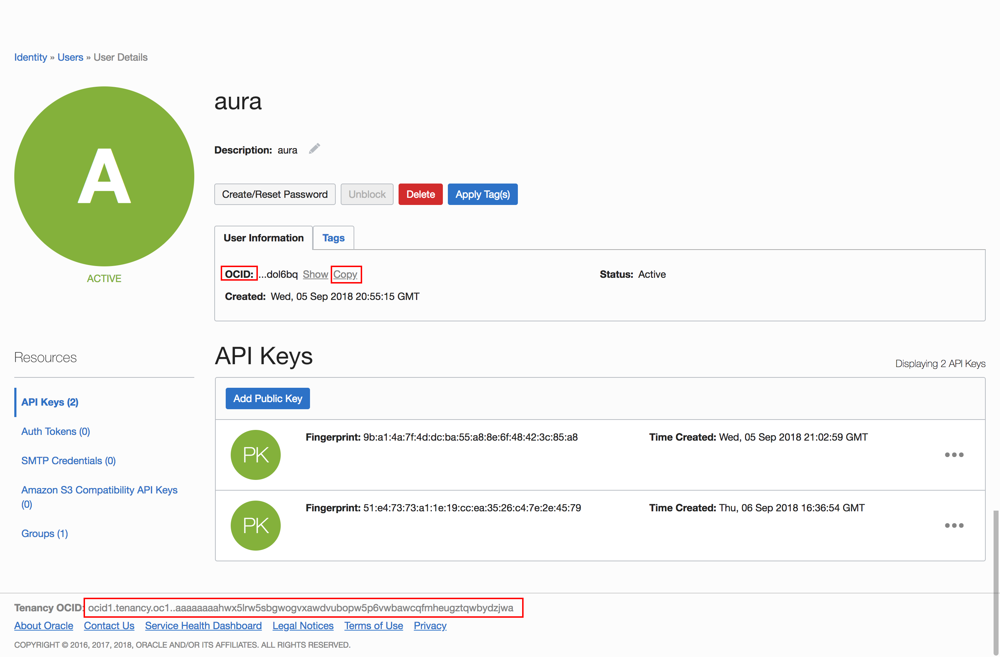

Now get the Cluster OCID. Open OKE console.

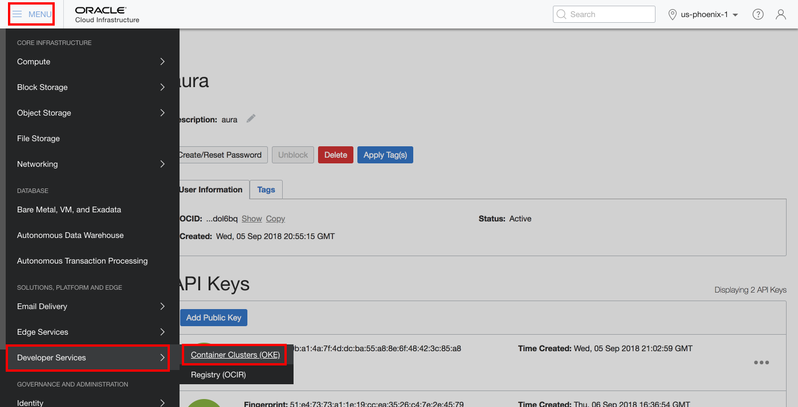

Select your compartment and click on your cluster.

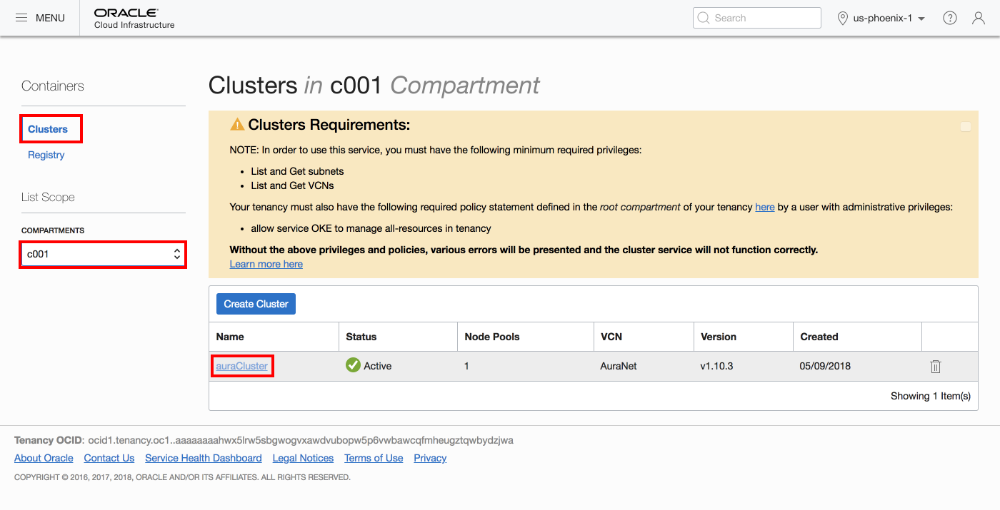

Click Copy link next to the Cluster Id label on the Cluster Details area. Note your Cluster OCID.

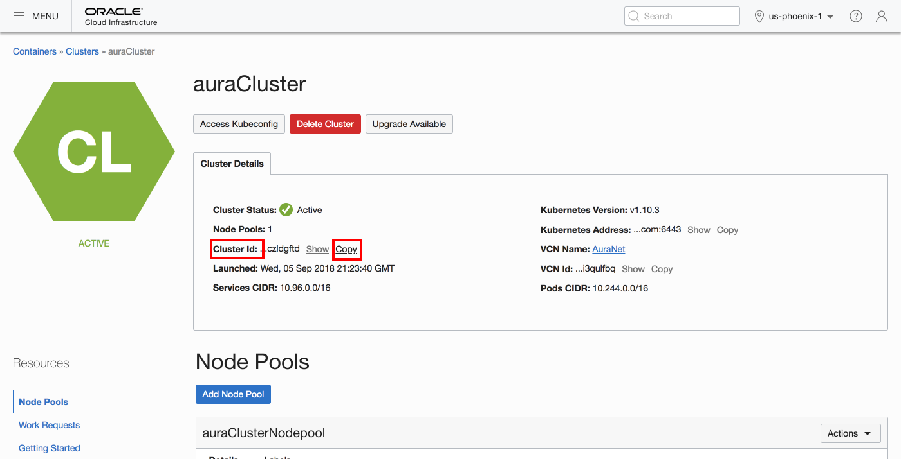

Now you have the necessary details to setup OCIcli within build environment. Switch back to your DevCS project to create the next build job.

In your DevCS project from the left navbar choose Build. Click +New Job to create a build job.

Fill out the following:
-	Job Name: deploy_service_V1
-	Description: deploy service V1
-	Create New: yes
-	Software Template: eca-template

Click Create Job.

The build job configuration appears. On the first Source Control tab click Add Source Control and select Git. From the Repository dropdown list select the source code repository for service V1.

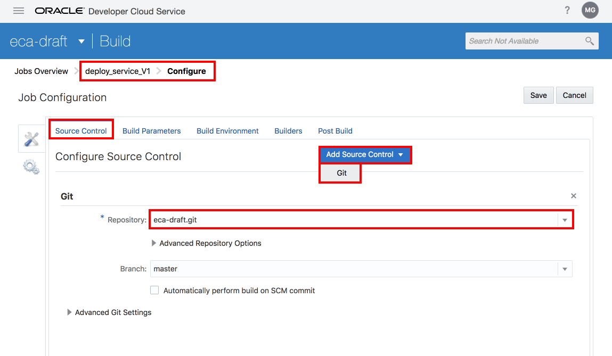

Change to Builders tab and define the build steps. Add your first step by clicking on Add Builder button. Select OCIcli Builder.

Fill out the following:
-	User OCID: <user-ocid\> what you find and noted previously
-	Fingerprint: shared by instructor
-	Tenancy: <tenancy-ocid\> what you find and noted previously
-	Private Key: shared by instructor
- Region: US_Ashburn_1 ("us-ashburn-1")

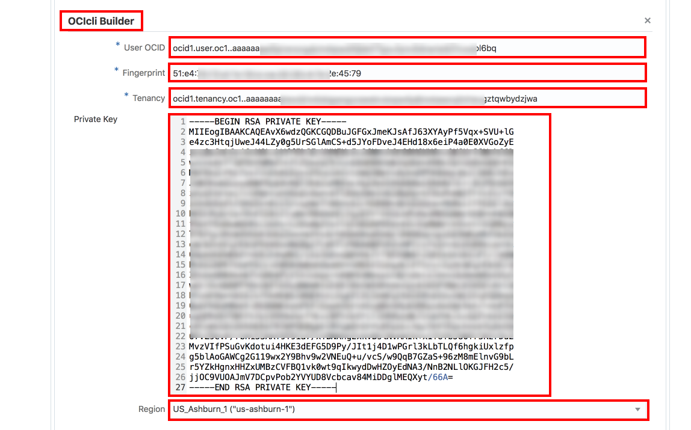

The builder step above configures the OCIcli tool. In the next step a script (available in the repository) will download the `kubectl` configuration file. Add Unix Shell Builder.

Copy the following commands to the script text area. Please replace the <cluster-ocid\> parameter to your Cluster OCID.

    mkdir -p $HOME/.kube

    export ENDPOINT="containerengine.us-phoenix-1.oraclecloud.com"

    ./get-kubeconfig.sh <cluster-ocid> > $HOME/.kube/config

    kubectl get nodes

Add another Unix Shell Builder which will execute the service V1 deployment. Copy the following commands into the script area. Don't forget to replace <compartment-name\> and <auth-token\> properly.

    export COMPARTMENT="<compartment-name>"
    envsubst < kubernetes/ecadraft1.yaml > kubernetes/ecadraft1.final.yaml

    cat kubernetes/ecadraft1.final.yaml

    kubectl create secret docker-registry regcred --docker-server=phx.ocir.io --docker-username=showitbuildit1/aura --docker-password=<auth-token> --docker-email=aura@acme.com || echo 'secret exists'

    kubectl apply -f kubernetes/ecadraft1.final.yaml

    sleep 5

    kubectl expose deployment ecadraft-v1 --type=LoadBalancer --name=ecadraft-v1-service
    kubectl get svc

Yous should have similar builders configuration for deploy_service_V1 job:

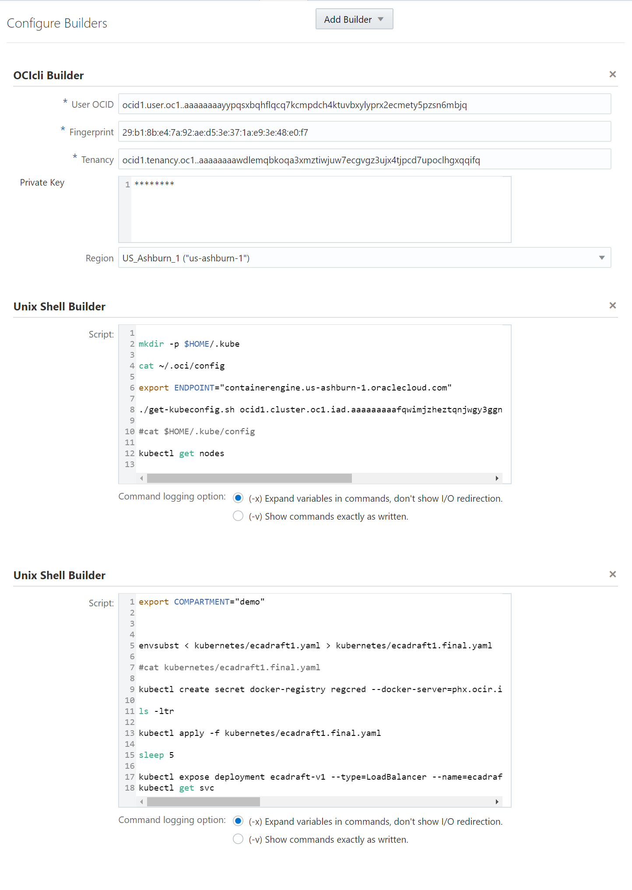

Click Save and execute the deploy_service_V1 build job.

The step above will also print the IP address and port to access through browser. Once the job completed check the log. Click on the log icon to get the build log.

In the log find the output of the "kubectl get svc" command:

It has to be a public IP address and port. When you have this execute the following `curl` command to test the application:

    $ curl -v http://IP:PORT/tickets
    {"_items":[{"customer":"Krajcik Inc","status":"Resolved","product":"Licensed Wooden Salad","_id":"25ccbcc4-a989-4334-a341-fcc18e4efced"...

### Bonus: Define pipelines in Developer Cloud Service

Now that you have two build jobs, one for building and another for deploying the service, you can connect the two into a single flow pipeline. This way you can automate the deployment of new versions whenever a build happens.

1. In Developer Cloud Service, click the build section in the left side menu, and switch to the "Pipelines" tab.
2. Click "New Pipelines" to create a new pipeline and give it a name "DockerFlow"
3. Drag the two jobs into the diagram. Connect them with an arrow so when the build job finishes it auomtatically invokes the deploy job.
4. You can directly run this flow, or set the flow to start auotmatically when one of the jobs starts.

