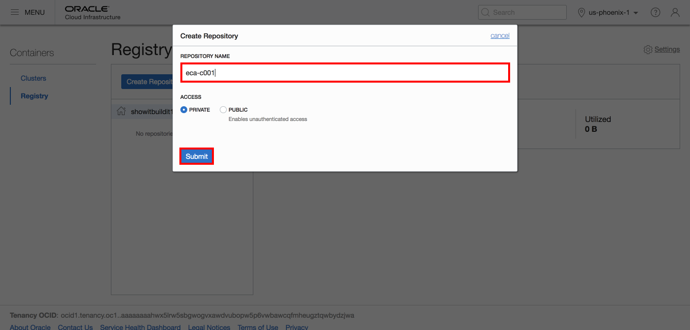
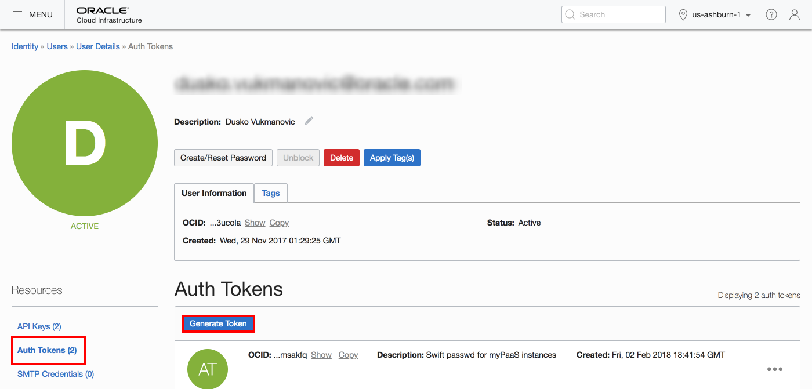
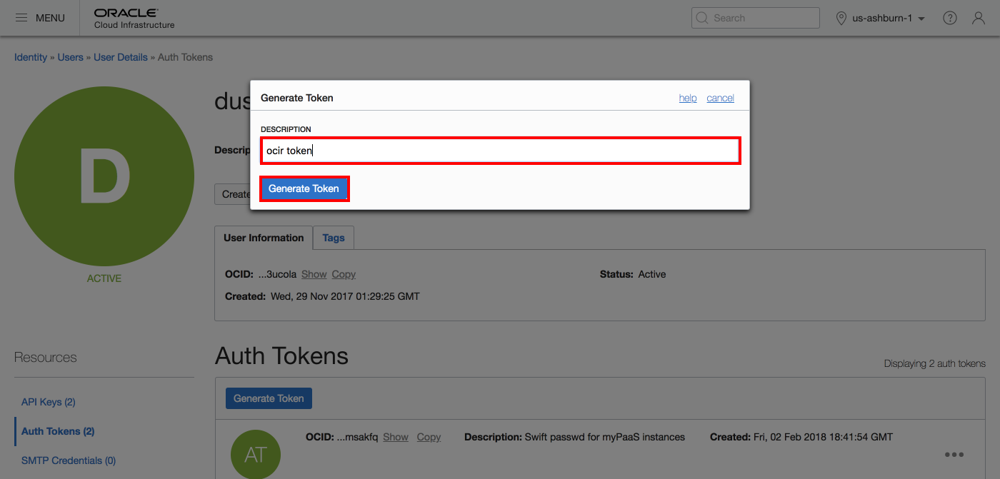
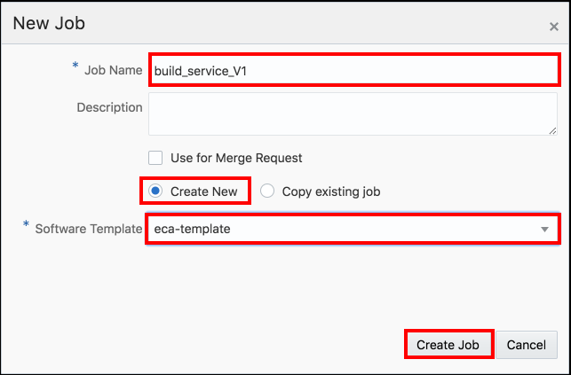
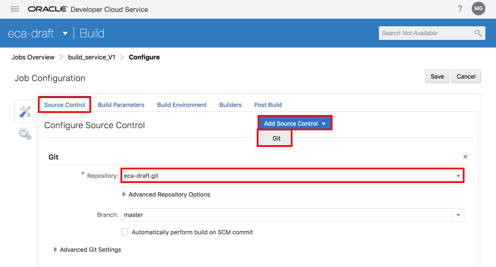

# Implement API endpoint and complete canary deployment on Microservices using Oracle Developer Cloud Service

## Lab Overview
In this lab you’ll learn how to leverage Oracle Developer Cloud Service to build container packaged application (API endpoint), push to Oracle Cloud Infrastructure Registry finally deploy to Microservices platform using build jobs. The key steps are the following:

1. Create container repository using Oracle Cloud Infrastructure Registry to store container packaged services (V1, V2)
2. Create build job to package service V1 in container and push to container registry
3. Deploy service V1 to Microservices platform and test
4. Create build job to package service V2 in container and push to container registry
5. Deploy service V2 to Microservices platform
6. Check that service is still being served fully by V1
7. Change the Istio rule to define canary deployment and define traffic percentages as 50/50 and check that half of the requests are being served by V1 and half by V2
8. Change the Istio rule to define canary deployment and define traffic percentages as 0/100 and check that all requests are being served by V2

## Prerequisites

- [DevCS project contains application source code repository](DevCS.md)
- Microservices platform running on Oracle Kubernetes Engine
- Access to OCI-OKE console

### 1. Create container repository using Oracle Cloud Infrastructure Registry to store container packaged services

Open your OCI console and from the left navbar choose Developer Services than select Registry(OCIR).

Click Create Repository.

Fill out the following:
-	Repository Name: eca-training
-	Access: Private

Click Submit.

Verify the repository.

This is a private repository hence you need to authenticate when you want push or pull images. Authentication requires your (OCI) user name and a generated Auth Token.

In the top-right corner of the Console, open the User menu (User menu icon) and then click User Settings to view the details.

On the Auth Tokens page, click Generate Token.

Enter a friendly description for the auth token and click Generate Token. The new auth token is displayed.
Copy the auth token immediately to a secure location from where you can retrieve it later, because you won't see (!) the auth token again in the Console.
Close the Generate Token dialog.

Now the repository is ready and you have the token to authenticate.

### 2. Create build job to package service V1 in container and push to container registry

Open your DevCS project and from the left navbar choose Build. Click +New Job to create a build job.

Fill out the following:
-	Job Name: build_service_V1
-	Description: build and store service V1
-	Create New: yes
-	Software Template: eca-template

Click Create Job.

The build job configuration opens. On the first Source Control tab click Add Source Control and select Git. From the Repository dropdown list select the source code repository for service V1.

Change to Builders tab and define the build steps. Add your first step by clicking on Add Builder button. Select Docker Builder than Docker login.

Fill out the following:
-	Registry Host: <region-code\>.ocir.io

  Where <region-code\> corresponds to the code for the Oracle Cloud Infrastructure Registry region you're using, as follows:

| Region code| Region Name |
|------------|-------------|
| fra | Frankfurt |
| iad | Ashburn |
| lhr | London |
| phx | Phoenix |

-	Username: build and store service V1
-	Password: yes
-	Software Template: eca-template

